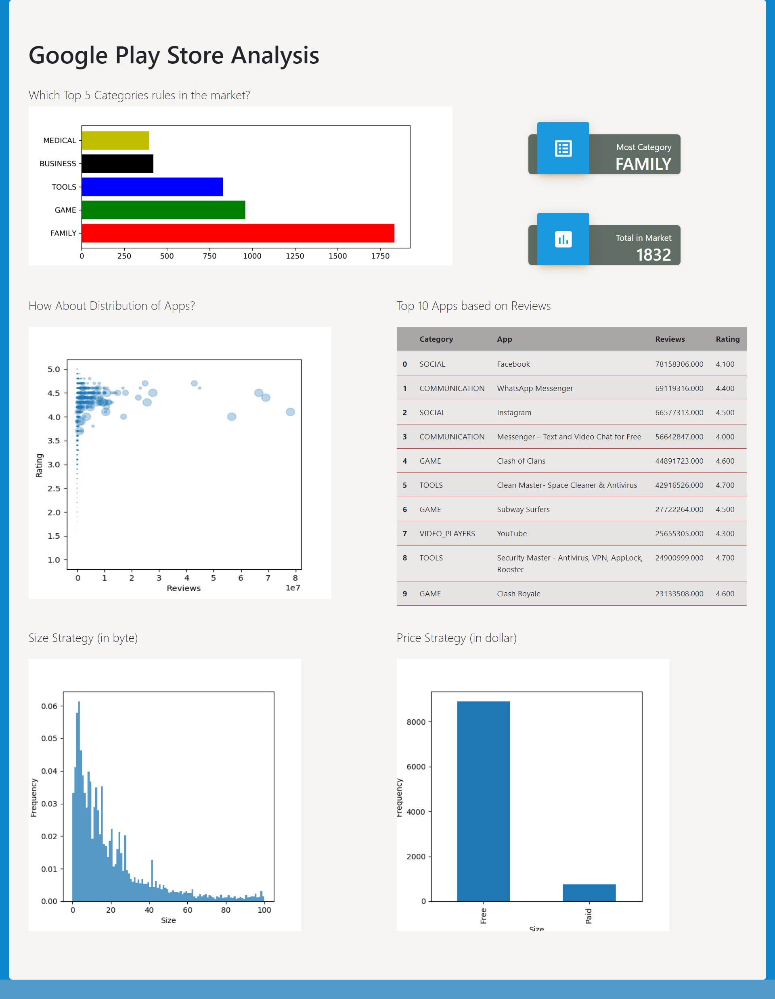

# Google Play Store Analytics



## Introduction
Projek ini dikembangkan sebagai salah satu capstone project dari Algoritma Academy Data Analytics Specialization. Deliverables yang diharapkan adalah Anda dapat membangun sebuah aplikasi web sederhana (dashboard) menggunakan framework Flask. Capstone ini akan fokus pada tampilan user interface Flask. 

## Project Requirements

**Relevant Topics**:
- Python for Data Analysts (P4DA)
- Exploratory Data Analysis (EDA)
- Data Wrangling and Visualization (DWV)

**New Exploratory Topics**:
- Visualization using `matplotlib`
- Build Dashboard UI using `flask`

**Workflow**:
- Virtual Environment Preparation
- Data Preprocessing
    - Data Cleansing
    - Data Wrangling
    - Data Aggregation
- Data Visualization
- Build Dashboard UI

## Data Summary
Data yang digunakan pada capstone project ini adalah data hasil scraping dari Google Playstore App. Data Google Playstore App terdiri dari beberapa variabe dengan rincian sebagai berikut:
- `App` : Nama aplikasi                
- `Category` : Kategori aplikasi
- `Rating` : Rating keseluruhan yang diberikan oleh user aplikasi(ketika di scrap)
- `Reviews` : Jumlah review yang diberikan oleh user aplikasi(ketika di scrap)
- `Size` : Ukuran aplikasi(ketika di scrap)           
- `Installs` : Jumlah user yang menginstall/mendownload aplikasi(Ketika di scrap)     
- `Type` : Tipe aplikasi (berbayar/gratis)       
- `Price` : Harga aplikasi (ketika di scrap)        
- `Content Rating` : Kelompok usia aplikasi ini ditargetkan - Children / Mature 21+ / Adult   
- `Genres` : Genre aplikasi.        
- `Last Updated` : Tanggal kapan aplikasi terakhir diperbarui di Play Store (ketika discrap) 
- `Current Ver` : Versi aplikasi saat ini tersedia di Play Store (ketika discrap)   
- `Android Ver` : Minimum versi Android yang diperlukan (ketika discrap) 

## Dependencies
- Flask
- Matplotlib
- Pandas
- Numpy

## Rubrics
Pada capstone ini, Anda diharapkan untuk dapat membangun sebuah aplikasi Flask yang fokus pada tampilan user interface. Langkah pertama yang harus Anda lakukan adalah silahkan download atau clone repository ini. File `flask-ui-skeleton.ipynb` merupakan sebuah skeleton untuk membuat sebuah dashboard aplikasi Flask. Pada bagian `app.py` dan `templates/index.html` ada beberapa bagian yang rumpang dan harus Anda lengkapi. 

Beberapa bagian yang harus diperhatikan adalah sebagai berikut:

### 1. Setting Repository Github dan Environment (2 poin)

**Repository**

a. Membuat repository baru di Github

b. Clone repository tersebut ke local dengan git clone

**Environment**

a. Membuat virtual environment "capstone-flask"

Hal pertama yang harus dilakukan adalah melakukan pengaturan conda environment. Untuk menyiapkan conda environment, silahkan gunakan command berikut:

```
conda create -n <ENV_NAME> python=3.10
conda activate <ENV_NAME>
```

b. Install packages: `pandas`, `flask`, `matplotlib`, dan `numpy`

Seluruh dependecies telah di-export ke dalam file requirements.txt. Oleh karena itu untuk melakukan install packages, Anda dapat menggunakan perintah berikut:

```
pip install -r requirements.txt --user
```

### 2. Data Preprocessing and Exploratory Data Analysis (2 poin)

Pada tahap ini, Anda diminta untuk melengkapi proses menghapus data yang duplikat, mengubah tipe data dan memodifikasi nilai data. Pada file `app.py`, Anda diminta untuk melengkapi data yang rumpang tanpa mengubah alur preprocessing yang telah ada.

Berikut ini contoh bagian yang harus Anda lengkapi saat preprocessing data:

```
playstore._________(subset = ___________________) 

# bagian ini untuk menghapus row 10472 
playstore = playstore.drop([10472])

playstore['Category'] = ___________________________
# Buang tanda koma(,) dan tambah(+) kemudian ubah tipe data menjadi integer
playstore['Installs'] = ________.apply(lambda x: x.replace(______))
playstore['Installs'] = ________.apply(lambda x: x.replace(______))

playstore['Installs'] = ___________________________
```

### 3. Data Wrangling (4 poin)

Pada tahap ini Anda diminta untuk melakukan grouping dan agregasi data. Data wrangling digunakan untuk menyiapkan data yang tepat sesuai analisis yang diminta. Pada capstone ini terdapat objek dictionary dengan nama `stats` dan Anda diminta untuk melengkapi bagian yang rumpang agar menghasilkan data/nilai yang sesuai.

### 4. Data Visualization

- (1 poin) Membuat atau menduplikasi bar plot yang menggambarkan top 5 Category pada Google Playstore
- (1 poin) Membuat atau menduplikasi scatter plot yang menggambarkan sebaran aplikasi jika dilihat berdasarkan Review, Rating, dan jumlah aplikasi yang terinstall.
- (1 poin) Membuat atau menduplikasi histogram plot untuk melihat distribusi ukuran aplikasi 
- (1 poin) Membuat 1 plot tambahan bebas yang dapat merepresentasikan insight di dalam data


**Note** : Anda dapat melihat contoh plot lain yang hraus dibuat/diduplikat pada repository ini. Silahkan clone/download repository ini. 

### 5. Build Flask App (4 poin)
Mengacu pada poin ke empat Data Visualization di atas, selain membuat plot baru Anda harus mendemonstrasikan bagaimana cara merender plot tersebut pada aplikasi Flask dan menampilkannya pada templates / halaman html. Yang perlu Anda perhatikan adalah pada bagian `app.py`:
```
render_templates(__________)
```
dan pada `templates/index.html` Anda perlu memanggil source plot.png tempat Anda menyimpan gambar plot tersebut.
```

```
